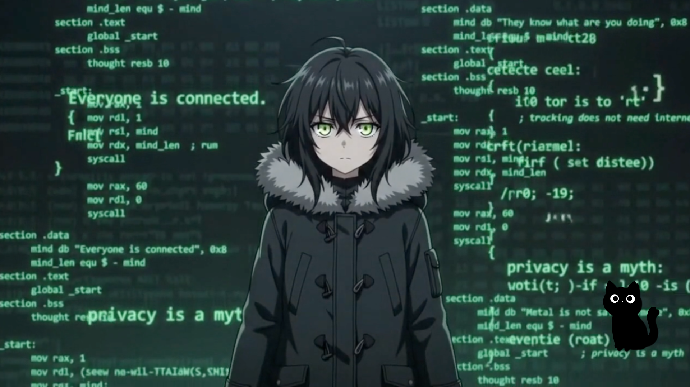

  

 

  

  

 

---

## 👩‍💻 About Me

🛠️ I'm currently working on **web applications, AI-powered tools & automation**

🤝 I'm looking to collaborate on **open-source, web development & AI projects**

🌱 I'm currently learning **advanced React, Next.js, backend development & AI integration**

💬 Ask me about **Java, JavaScript, React, Next.js, SQL, Supabase & AI applications**

🚀 I enjoy turning **ideas into scalable, real-world products**

🧠 I'm interested in **AI, automation, full-stack development & problem solving**

⚡ Fun fact: **I learn best by building things**

🎯 My goal is to create **technology that solves real-world problems**

---

## 🌐 Connect With Me

---

## 💻 Tech Stack

### 👨‍💻 Programming Languages

### 🌐 Frontend Development

### ⚙️ Backend & Database

### 🛠️ Tools & Technologies

### 🤖 AI & Automation

---

## 📊 GitHub Stats

---

## 🔥 GitHub Streak

---

## 📈 GitHub Activity

---

## 🧠 Developer Philosophy

<b>Learn → Build → Break → Fix → Improve → Repeat</b>

  

<i>"The best way to learn technology is to build something with it."</i>

  

💡 Stay curious.  
🛠️ Keep building.  
🚀 Keep improving.

---

## 🐍 My Contribution Graph

---

👋 <b>Thanks for visiting my profile!</b>

  

Let's build something amazing together. 🚀

  

